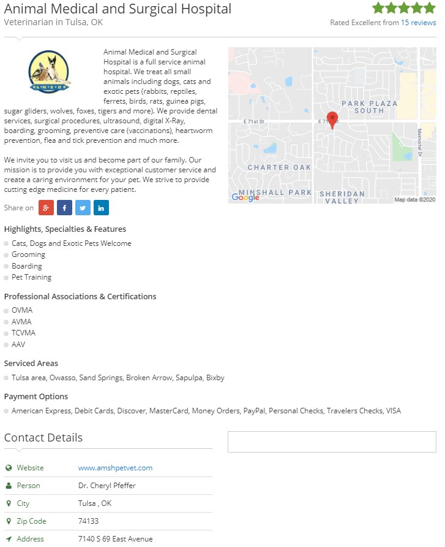

## USA Veterinarians

Page snippet



Output snippet

```json
{
    "business_name": "Animal Medical and Surgical Hospital",
    "description": "Animal Medical and Surgical Hospital is a full service animal hospital.  We treat all small animals including dogs, cats and exotic pets (rabbits, reptiles, ferrets, birds, rats, guinea pigs, sugar gliders, wolves, foxes, tigers and more).  We provide dental services, surgical procedures, ultrasound, digital X-Ray, boarding, grooming, preventive care (vaccinations), heartworm prevention, flea and tick prevention and much more.  ",
    "state": "Oklahoma",
    "county": "Tulsa County",
    "city": "Tulsa",
    "contact": {
      "website": "www.amshpetvet.com",
      "person": "Dr. Cheryl Pfeffer",
      "zip_code": "74133",
      "address": "7140 S 69 East Avenue",
      "phone_number": "(918) 492-2674"
    },
    "highlights": [
      "Cats, Dogs and Exotic Pets Welcome",
      "Grooming",
      "Boarding",
      "Pet Training"
    ],
    "associations": [
      "OVMA",
      "AVMA",
      "TCVMA",
      "AAV"
    ],
    "serviced_areas": [
      "Tulsa area, Owasso, Sand Springs, Broken Arrow, Sapulpa, Bixby"
    ],
    "payment_options": [
      "American Express, Debit Cards, Discover, MasterCard, Money Orders, PayPal, Personal Checks, Travelers Checks, VISA"
    ],
    "hour_operation": {
      "Monday": "07:30 AM ÷ 07:00 PM",
      "Tuesday": "07:30 AM ÷ 07:00 PM",
      "Wednesday": "07:30 AM ÷ 06:00 PM",
      "Thursday": "07:30 AM ÷ 06:00 PM",
      "Friday": "07:30 AM ÷ 06:00 PM",
      "Saturday": "08:00 AM ÷ 01:00 PM",
      "Sunday": "Closed"
    },
    "nearest_cities": {
      "Sand Springs OK": "8.5 mi",
      "Sapulpa OK": "12.7 mi",
      "Collinsville OK": "17.0 mi",
      "Bixby OK": "17.6 mi",
      "Bartlesville OK": "41.0 mi",
      "Muskogee OK": "44.7 mi",
      "Okemah OK": "51.9 mi",
      "Edmond OK": "90.0 mi",
      "Oklahoma City OK": "97.6 mi"
    }
  }
```